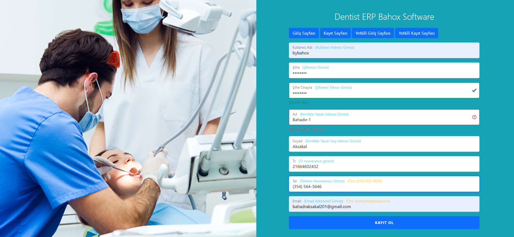
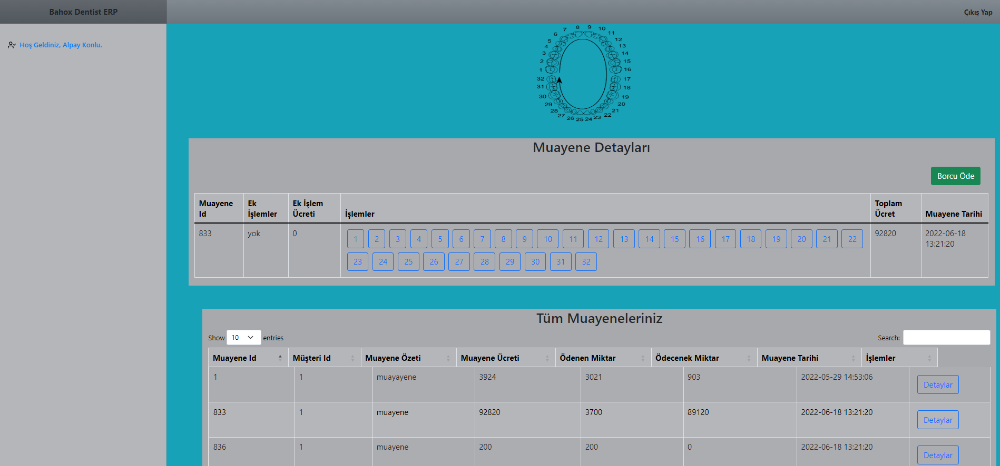
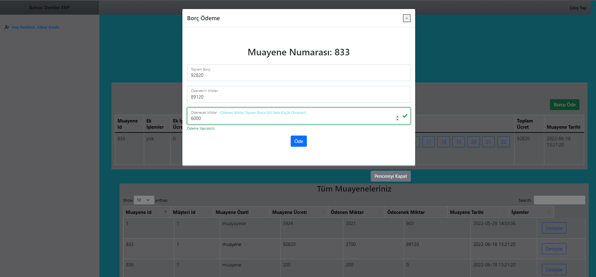
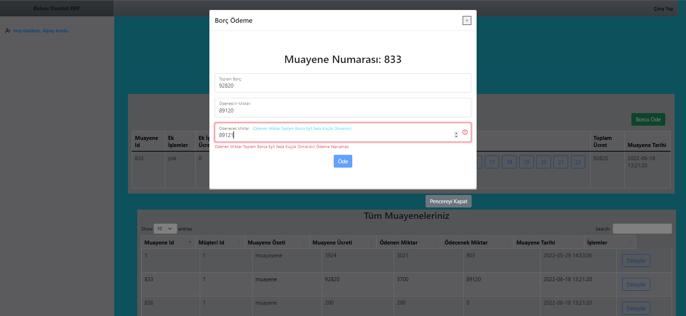
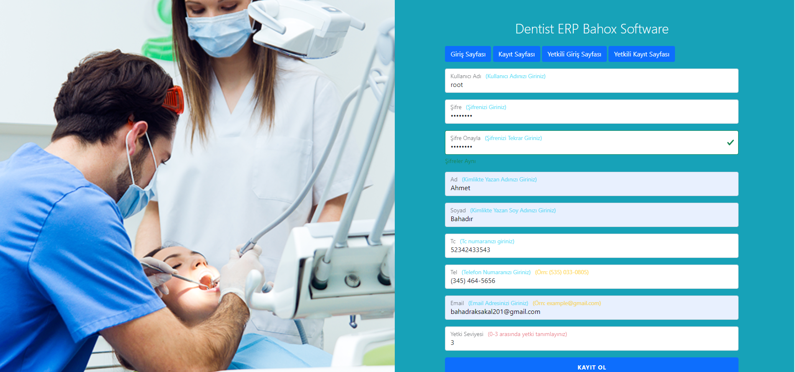
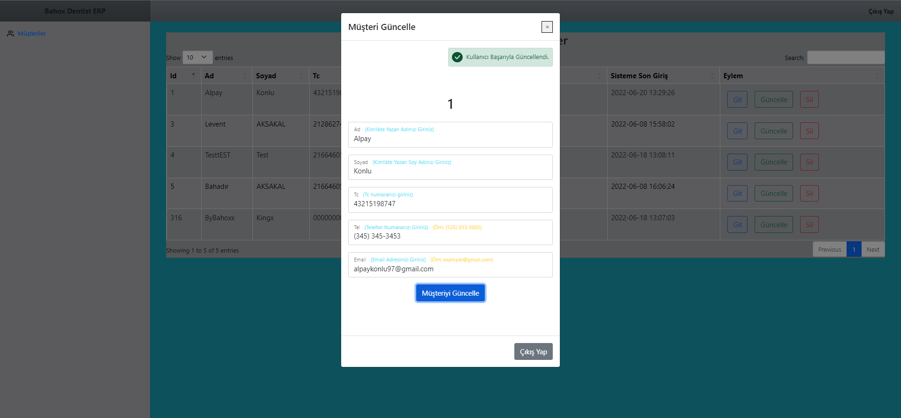
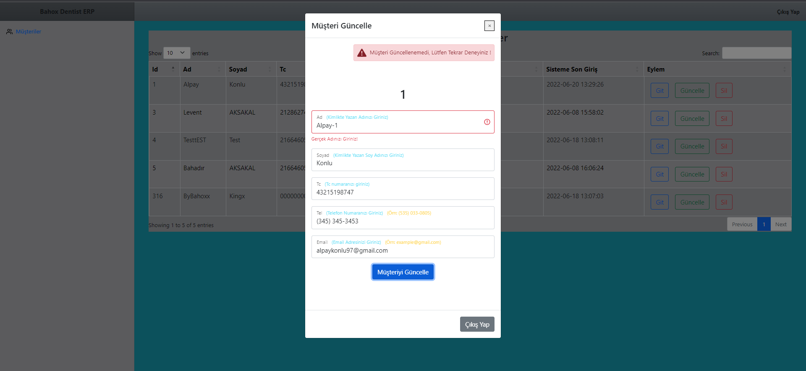
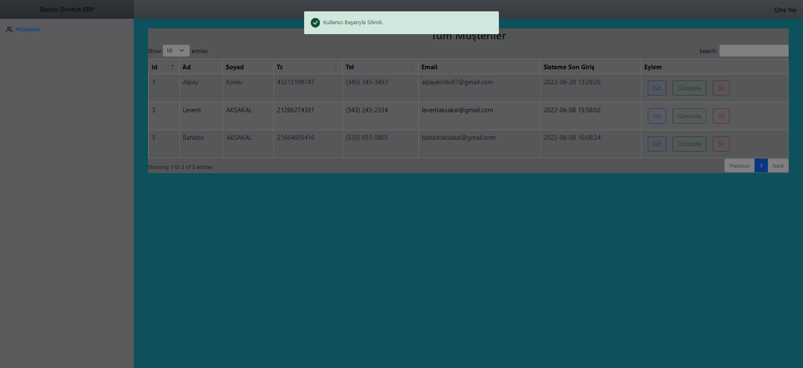
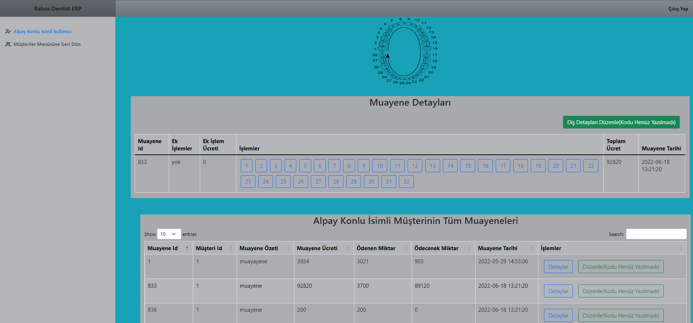
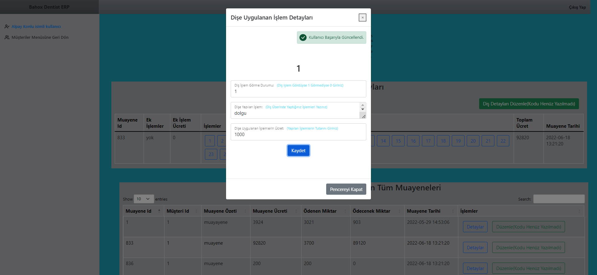

<h2 align="center">Dentist ERP</h2>
<h3 align="center" color="Darkblue">Ahmet Bahadır Aksakal</h3>
<h4 align="center" color="Darkblue">20360859079</h4>
<h5 align="center" color="Darkblue">2. Sınıf Bahar Dönemi Web Programlama Projem Final</h5>

<ol>
  <li>
      <h3 color="Red">Projede Kullanılan Teknoloji Ve Diller:</h3>
      <ul>
        <li><strong> Php - Herhangi Bir Framework Kullanılmamıştır</strong></li>
        <li><strong> MySql</strong></li>
        <li><strong> JavaScript</strong></li>
        <li><strong> Ajax</strong></li>
        <li><strong> Jquery</strong></li>
        <li><strong> Bootstrap 5.0</strong></li>
        <li><strong> CloudTables - DataTables</strong></li>
        <li><strong> Css</strong></li>
      </ul>
  </li>
   <li>
      <h3 color="Red">Projenin Amacı ve Kullanımı: </h3>
      <ul>
        <li>Dişçiye gelen hastaların, tüm muayenelerin, yetkili doktorlarınve personellerin tüm işlemlerinin kayıt altına alınıp takip edildiği bir ürün ortaya konmaya çalışılmıştır.</li>
        <li>Doktorlar şimdiye kadar gelen tüm hastaların her bir muayenesini görüntüleyebilir, ilgili değişkiliği yapabilir ve hastanın ödeme yapıp yapmadığını görebilir.</li>
        <li>Bir hastanın ödeme yapacağı miktar şu şekilde hesaplanır: Ek İşlem Ücreti + Tüm Dişler İçin ayrı ayrı girilmiş fiyatlar.</li>
        <li>Firma dilerse iş yoğunluğu yada farklı sebeplerden total ücreti  ek işlem ücretine girip dişler için ayrı ayrı ücret girmeyebilir.</li>
        <li>Programda iş takip sürecini daha detaylı bir hale getirebilirsiniz yada detayları girmeden farklı alanları verileri toplanmış olarak girerek iş süreç takibine ayırdığınız zamanı azaltabilirsiniz.</li>
        <li>Müşteriler internet sitesi üzerinden uygulamaya kayıt olup, tüm muyaneleri ve her bir muayenede dişlerine uygulunan işlemleri ayrı ayrı görüntüleyip dilediği gibi ödeme yapabilir.</li>
        <li>Projede sql injection ve gerekli tüm güvenlik kurallarına fazlasıyla dikkat edilmiştir.</li>
        <li>Proje demo'dur çalışmayan bazı butonlar vardır ve uygulama ekranında belirtilmiştir. Hiç Eklenmemiş bir kaç sayfada vardır.</li>
        <li>Proje esnek bir yapıdadır bir çok şey sonradan eklenebilir yada güncellenebilir.</li>
      </ul>
  </li>
  <li>
      <h3 color="Red">Görseller:</h3>
      <ul>
        <li></li>
        <li></li>
        <li></li>
        <li></li>        
        <li></li>
        <li></li>
        <li></li>
        <li></li>
        <li></li>
        <li></li>
        <li></li>
      </ul>
  </li>
  </ol>
      <h3 color="Red">Video:</h3>

  

[![Watch the video]]([https://github.com/bahadraksakal/Dentist-ERP-FULL/blob/main/dentist-erp-tanitim-kurulum.mp4])
<video src="https://github.com/bahadraksakal/Dentist-ERP-FULL/blob/main/dentist-erp-tanitim-kurulum.mp4"></video>

    

